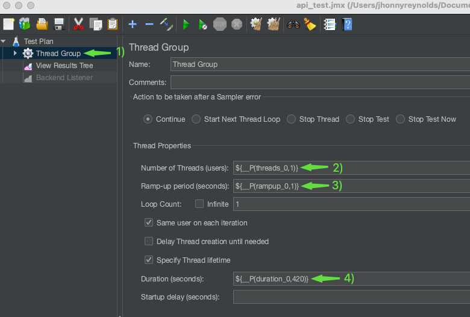

# Performance Tests

## System Overview
This project is created to perform tests using JMeter tool

# <a name="setup"></a>Setup Instructions

### Prerequisites
1. Install Java 8 or higher ( https://www.oracle.com/co/java/technologies/javase/javase8-archive-downloads.html)
2. Download JMeter tool (https://jmeter.apache.org/download_jmeter.cgi)
3. We need to choose the .zip file in the Binaries option:

   
4. Unzip the .zip file and run the jmeter file from /bin folder in console to open JMeter tool:

   `apache-jmeter-5.6.3/bin/./jmeter`
### How to run Performance Tests (JMeter UI)
1. Open Jmeter and click on the open file button. 

   Use the file with `.jmx` extension, located in the directory:
   ```
   api_test.jmx
   ```
   Example: `api_test.jmx`

   

2. Click on the thread group, then specify how many threads are needed, the ramp-up and the duration of the test in seconds:

   

   By default has the following values in the underlined part of the image:
   ```
   Number of Threads: 1
   Ramp-up: 1 second
   Duration: 420 seconds
   ```

5. Click on `View Results Tree` element and run the test:

   

### How to run Performance Tests (JMeter Console)

1. Run the next command in the console:

   `/{path}/apache-jmeter-5.6.3/bin/jmeter -n -t /{path}/api_test.jmx -l results.jtl`

   Example:
    ```
    /Users/jhonnyreynolds/Documents/apache-jmeter-5.6.3/bin/jmeter -n -t /Users/jhonnyreynolds/Documents/microservices-workshop/test/jmeter/api_test.jmx -l results.jtl
    ```
