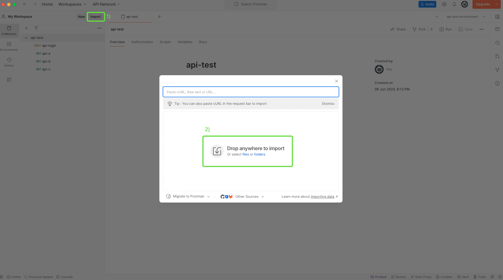
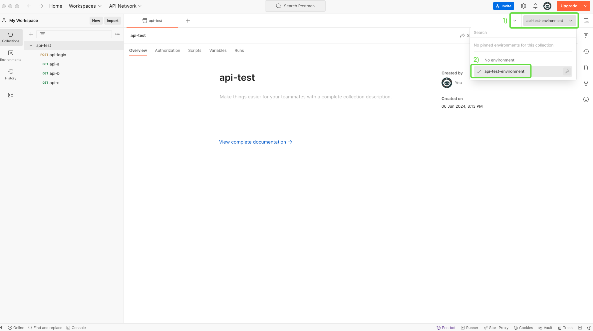
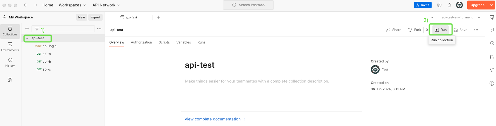
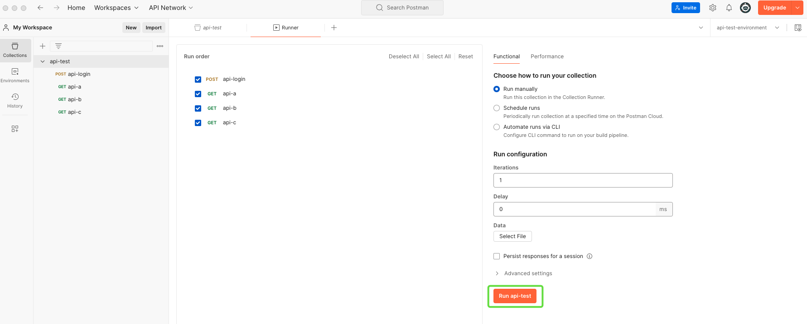
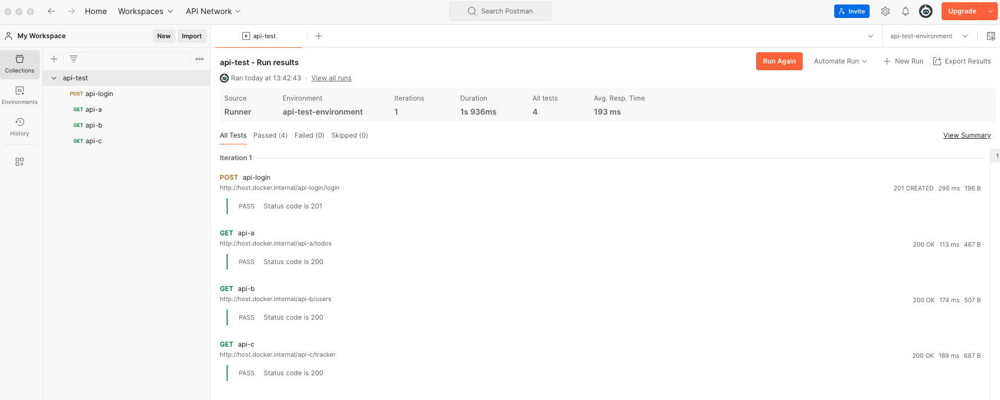

# **Table of content:**
1. ✅ [Postman installation](#one)
1. ✅ [Importing the collection and the environment](#two)
1. ✅ [Running a collection](#three)
1. ✅ [Newman Execution](#four)
<!-- headings -->
<a id="one"></a>
## Postman installation
### Before executing 📋

_You must have Postman software installed on your machine, if not, go to this link and download it:_
```
https://www.postman.com/downloads/
```
_Have npm installed if you want to execute newman tests_

<!-- blank line -->
----
<!-- blank line -->

<a id="two"></a>
## Importing the collection and the environment

1. Click on the *Import*  button of your workspace, then drag and drop the collection you want to import in modal window.<br>
Further information for postman workspaces on this link:
```
https://learning.postman.com/docs/getting-started/first-steps/creating-your-first-workspace/
```

*Importing "api-test.postman_collection.json" from postman folder*

2. To import the environment you can repeat the previous steps but drag and drop an environment json.

> Postman recognizes when you're importing a collection or an environment

<a id="three"></a>
## Running a collection

Before running the collection we have to assign and configure our environment.

1. Assign an environment by selecting one of the environment previously imported


2. Click on the collection and then click on the *Run* icon on the upper right of the screen.



3. Click on the "*Run (Collection Name)*"  button




<a id="four"></a>
## Newman Execution

_Install the newman as follows:_
```
npm install -g newman
```
_run the command_

```
newman run path/api-test.postman_collection.json -e path/api-test-environment.postman_environment.json
```
