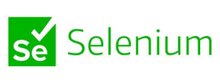
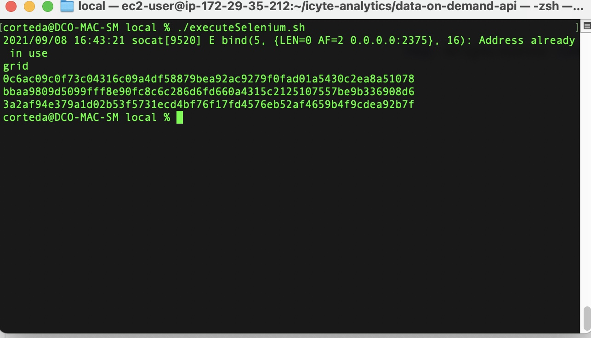
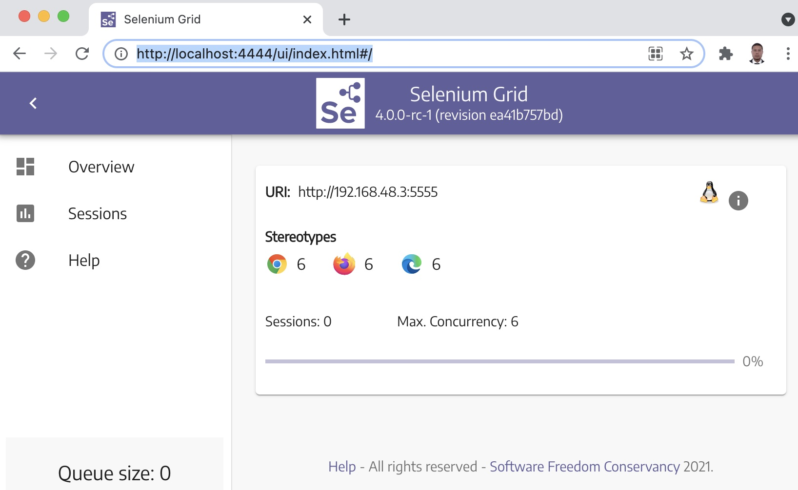

# Selenium GRID V.4.0

## Local implementation 

**Selenium Grid V4.0** allow to be installed in a local environment, in this case, let's go to use docker to publish the images..

### Requirements
* Docker, installer can be found [here](https://docs.docker.com/engine/install/) 

## Installing

1. Open a console.
2. Move to the folder infrastructure/local.
3. Execute **./executeSelenium.sh** command.

4. Validate the Selenium Grid Service, open a browser in **http://localhost:4444/ui/index.html#/**

